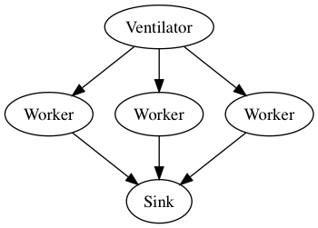
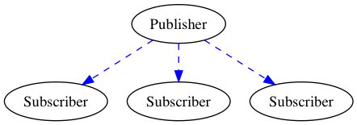
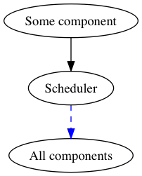
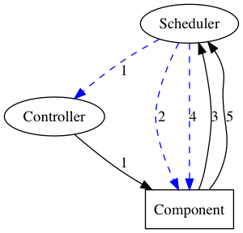
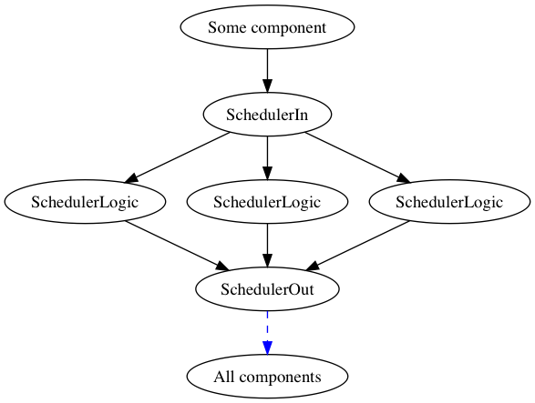

# monique (monitored queue, MQ)

## Запуск компонентов Scheduler

### config.json

В конфигурационном файле описываются сетевые и логические настройки.

Сетевые настройки хранятся в разделе `deploy - monique`.
Как уже упоминалось, каждый компонент имеет разделение на технический и коммуникационный уровни.
Также же деление есть и у компонентов Scheduler (In, Logic, Out).
В разделе `deploy - monique` описываются поля:
  * `scheduler-in` - настройки для подключения внешних компонентов к "входному" Scheduler;
  * `scheduler-in-logic` - настройки для подключения "логических" Scheduler ко "входному";
  * `scheduler-logic-out` - настройки для подключения "логических" Scheduler к "выходным";
  * `scheduler-out` - настройки для подключение внешних компонентов к "выходному" Scheduler.
  
Если все три составляющие Scheduler запускаются на одном хосте, тогда настройки из данного блока можно оставить без изменений.

Настройки для компонента Scheduler Logic хранятся в конфигурационном файле по пути `params - scheduler-logic` и включают поля:
  * `allow-messages` - список сообщений с допустимыми полями `spec`. Если принятое сообщение имеет поле `spec`, которое не указано в этом списке, тогда оно дальше не пройдёт и рассылаться далее не будет. Если список `allow-messages` пустой, это отключает любую фильтрацию сообщений и всякое сообщение будет разослано дальше.

### run

В департаменте вычислительной биологии компании BIOCAD приняты следующие правила запуска приложения: единственным необязательным параметром командной строки приложения может быть путь к конфиг файлу:

```
./app --config-file=/path/to/config.json 
./app -f /path/to/config.json
```

Если параметр с конфигурационным файлом не указан, берётся файл `config.json` из директории.

Перед запуском всех компонентов Scheduler следует убедиться, что файл config.json сформирован правильно.

После этого запуск компонентов Scheduler с помощью [stack](https://www.haskellstack.org/) происходит следующим образом: 

```
stack exec scheduler-in
stack exec scheduler-logic
stack exec scheduler-out
```

Для более быстрой обработки логики внутри `scheduler-logic` возможен запуск нескольких экземпляров `scheduler-logic`.

В случае появления новый видов сообщений (которые перечисляются в поле `allow-messages`) требуется перезапустить компоненты `scheduler-logic` для подгрузки новых изменений.
Для непрерывной работы очереди и для предотвращения потери сообщений рекомендуется перезапускать компоненты `scheduler-logic` последовательно.


Оглавление
* [Быстрый старт](#Быстрый-старт)
  * [Что такое MQ?](#Что-такое-mq)
  * [Какие концепции заложены в MQ?](#Какие-концепции-заложены-в-mq)
  * [Какая технология лежит в основе MQ?](#Какая-технология-лежит-в-основе-mq)
  * [Какие паттерны общения используются?](#Какие-паттерны-общения-используются)
    * [PUSH-PULL](#push-pull)
    * [PUB-SUB](#pub-sub)
  * [Какие компоненты предоставляет MQ, а какие нужно писать мне?](#Какие-компоненты-предоставляет-mq-а-какие-нужно-писать-мне)
  * [Что такое центральное место (Scheduler)?](#Что-такое-центральное-место-scheduler)
  * [Что такое компонент?](#Что-такое-компонент)
  * [Что такое контроллер?](#Что-такое-контроллер)
  * [Что такое коммуникационный уровень и технический уровень?](#Что-такое-коммуникационный-уровень-и-технический-уровень)
  * [Взаимодействие Scheduler-Component](#Взаимодействие-scheduler-component)
* [Прочее](#Прочее)
  * [Легенда схемы](#Легенда-схемы)

## Быстрый старт

### Что такое MQ?

MQ - это система для построения микросервисной архитектуры. *TODO: расписать подробнее.*

### Какие концепции заложены в MQ?

В системе заложены следующие идеи:

1. Микросервисы общаются друг с другом посредством сообщений.

2. В MQ существует центральное место, через которое происходит всё общение.

3. Сообщения имеют одинаковый и неизменяемый формат (единый протокол), который позволяет компонентам взаимодействовать друг с другом.

4. Любое сообщение в системе имеет документацию.

### Какая технология лежит в основе MQ?

MQ на данный момент построена поверх системы [ZeroMQ](http://zeromq.org/).

### Какие паттерны общения используются?

#### PUSH-PULL

Используется для организации распределённого процесса выполнения действий компонентами. 

Подключенный через **PUSH** компонент отдаёт сообщение. Подключенный через **PULL** компонент читает переданное ему сообщение. При использовании такого паттерна каждое отправленное через PUSH сообщение принимается лишь **одним** компонентом, подключенным через PULL.

Боле подробно про данный паттерн можно почитать в [официальном гайде](http://zguide.zeromq.org/page:all#Divide-and-Conquer) по ZeroMQ.

##### Пример PUSH-PULL



[легенда схемы](#Легенда-схемы)

Предположим, что компонент **Ventilator** генерирует определённое количество задач и отправляет их дальше через PUSH. 

В силу использования паттерна PUSH-PULL каждая задача направляется исключительно одному Worker'у из пула подключённых через PULL к Ventilator'у компонентов. Worker'ы после обработки задач отправляют результаты своих вычислений дальше через PUSH. 

Так как ко всем Worker'ам через PULL подключен только один **Sink**, то в него придут результаты всех вычислений, совершённых воркерами.

#### PUB-SUB

Используется для оповещения о каком-либо событии всех подписчиков компонента, называемого издателем.

Подключенный через **PUB** компонент передаёт сообщение всем своим подписчикам. Подключенный через **SUB** компонент читает переданное ему от издателя сообщение. При использовании такого паттерна каждое отправленное через PUB сообщение принимается **всеми** компонентами, подключёнными через SUB.

Боле подробно про данный паттерн можно почитать в [официальном гайде](http://zguide.zeromq.org/page:all#Getting-the-Message-Out) по ZeroMQ.

#### Пример PUB-SUB



[легенда схемы](#Легенда-схемы)

Предположим, что компонент **Publisher** генерирует сообщение и отправляет его через PUB. 

В силу использования паттерна PUB-SUB сообщение направляется всем **Subscriber**'ам из пула подключённых через SUB к Publisher'у компонентов. Каждый из Subscriber'ов получает идентичное сообщение и обрабатывает его согласно своей внутренней логике.

### Какие компоненты предоставляет MQ, а какие нужно писать мне?

Система MQ предоставляет центральное место, через которое проходят все сообщения в системе.

Также система предоставляет контроллеры (читай ниже), которые позволяют распределять задачи между однотипными компонентами.

Для того, чтобы подключиться к MQ, мне нужно реализовать компонент, который умеет общаться с MQ по заданному протоколу.

### Что такое центральное место (Scheduler)?

Scheduler в системе MQ является единой точкой входа и выхода всех сообщений, которые существуют в системе.

После того, как сообщение попадает в Scheduler, оно обрабатывается и рассылается в общий поток.
В zeromq есть специальный паттерн, который позволяет разослать сообщение всем компонентам в системе.
Это паттерн PUB.

Scheduler является также единой точкой входа для всех сообщений, которые пересылаются внутри системы.
Для этого Scheduler использует паттерн PULL.



[легенда схемы](#Легенда-схемы)

### Что такое компонент?

Компонентом в MQ называется любая сущность, которая способна в каком-либо виде общаться (даже если общение происходит в одностороннем порядке) со Scheduler'ом. 

### Что такое контроллер?

Контроллер в MQ представляет из себя компонент, задачей которого является предоставление Scheduler'у возможности коммуникации с ответственными за вычислительные действия компонентами посредством паттерна PUSH. 

Сам контроллер является подписчиком Scheduler'а, то есть связан с ним паттерном PUB-SUB.

Допустим, что мы хотим добавить в систему несколько компонентов, способных выполнять однотипные вычисления. 
Так как по умолчанию Scheduler передаёт сообщение через паттерн PUB, который отошлёт его **всем** подписчикам, то изначально у нас нет возможности поставить в систему задачу так, чтобы она выполнилась только одним из наших вычислительных компонентов. 
Однако если мы свяжем такие компоненты с контроллером, а не напрямую со Scheduler'ом, то мы сможем избежать лишних вычислительных действий за счёт того, что контроллер передаёт сообщения через паттерн PUSH, который направит задачу только на **один** из наших вычислительных компонентов.

### Что такое коммуникационный уровень и технический уровень?

Каждый элемент в системе MQ (будь то центральное место, контроллер или компонент) живёт одновременно в друх мирах, или уровнях.

**Коммуникационный** уровень предназначен для обмена сообщениями, которые характерны для логики и алгоритмов, реализуемых в компонентах системы.
Сообщения именно из этого уровня создаются и документируются разработчиками компонентов согласно правилам, описанным ниже.

**Технический** уровень предназначен для передачи служебных сообщений внутри системы. 
Сообщения из этого уровня одинаковы для всех элементов системы и не требуют документации со стороны пользователей системы.

### Взаимодействие Scheduler-Component

Компонент может взаимодействовать со Scheduler'ом посредством трёх каналов для передачи задач и двух каналов для передачи данных:
1. получение задач через паттерн [PULL](#push-pull) от контроллера, в который они приходят от Scheduler'а по паттерну [SUB](#pub-sub);
2. получение задач напрямую через паттерн [SUB](#pub-sub);
3. отправка задач напрямую через паттерн [PUSH](#push-pull);
4. получение данных напрямую через паттерн [SUB](#pub-sub);
5. отправка данных напрямую через паттерн [PUSH](#push-pull).



[легенда схемы](#Легенда-схемы)

На схеме синими пунктирными линиями помечены каналы, использующие паттерн PUB-SUB, а чёрными линиями — каналы, использующие паттерн PUSH-PULL.

## Подробности

### Устройство центрального места (Scheduler)

Как уже [упоминалось](#Что-такое-центральное-место-scheduler), в первом приближении Scheduler можно представлять как ящик, который принимает сообщение от какого-либо компонента на вход с помощью паттерна PULL и транслирует их всем компонентам с помощью паттерна PUB:


[легенда схемы](#Легенда-схемы)

Но что случится, если мы захотим каким-либо образом обрабатывать сообщения внутри Scheduler? 
К примеру, мы захотим фильтровать все сообщения, которые [не имеют документации](#Чем-важно-поле-spec)?
Или же мы захотим проверять с помощью сервиса авторизации пользователя или систему, от которого пришло сообщение?

Для решения данной проблемы Scheduler разбивается на 3 части:



[легенда схемы](#Легенда-схемы)

На данной схеме:
* `SchedulerIn` принимает сообщение и распределяет его **на одного** из `SchedulerLogic` с помощью паттерна [PUSH-PULL](#push-pull);
* `SchedulerLogic` принимает сообщение и обрабатывает согласно заложенной логике, после чего отсылает в `SchedulerOut` (также с помощью паттерна [PUSH-PULL](#push-pull)) или же фильтрует, не пересылая далее;
* `SchedulerOut` принимает обработанное сообщение и отсылает всем получателям с помощью паттера [PUB-SUB](#pub-sub).

Данный подход решает следующие задачи:
* отделить "легковесные" точки входа и выхода Scheduler'а от его "тяжёлых" частей, связанных с реализацией внутренной логики. Такое разделение позволяет легко масштабировать "тяжёлые" части;
* run-time обновление логики Scheduler, когда можно последовательно перезапустить центральный компонент без остановки обработки очереди.

## Прочее

### Легенда схемы

На представленных в документации схемах взаимодействия по протоколу [ZeroMQ](http://zeromq.org/) различных компонентов используются следующие обозначения:
* **чёрная стрелка** обозначает связь между компонентами через паттерн [PUSH-PULL](#push-pull);
* **синяя пунктирная стрелка** обозначает связь между компонентами через паттерн [PUB-SUB](#pub-sub).
