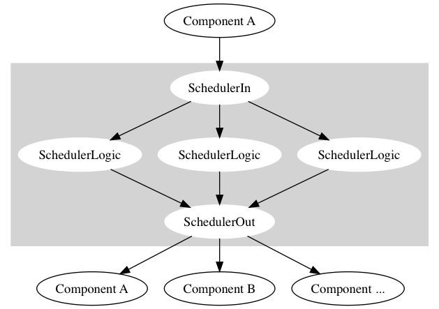

## Одно место (Scheduler)

Как уже неоднократно упоминалось, любое общение в MoniQue происходит через "одно место", которое также называется Scheduler.
Про него достаточно понимать то, что оно умеет принять сообщение от любого компонента, обработать по внутренней логике и разослать обратно в систему.

Для базового понимания этого достаточно. Ниже будут расписаны подробности реализации, внутренная логика и то, как запускается Scheduler.

### Подробности реализации

Как ни парадоксально, являясь по существу "одним местом", в жизни оно состоит из трёх небольших модулей.

Как всё это выглядит, показывает следующая картинка:



#### SchedulerIn

Первый модуль (входной) является "приёмником", который получает все сообщения, отправленные компонентами в систему.
После того, как сообщение принято, SchedulerIn рассылает его следующему модулю. 

Как мы помним, для отправки любого сообщения важно не только знать само сообщение с его тэгом, но и то, куда его нужно доставить.
Поэтому "приёмник" предоставляет компонентам хост и порт, на котором он принимает сообщения.
При общении с компонентами системы SchedulerIn пользуется схемой "Все в один", которая была описана в [транспортном слое](Transport.md).

Для того, чтобы второй модуль (SchedulerLogic) мог забрать у SchedulerIn сообщение, последний также предосталяет хост и порт для второго модуля.
На самом деле, вторых модулей может быть несколько, поэтому при общении с ними SchedulerIn пользуется схемой "Один к одному".

#### SchedulerLogic

Второй модуль (логический) получает сообщение от SchedulerIn, обрабатывает по какой-либо логике и отсылает в SchedulerOut.
Вторых модулей может быть несколько, так как, во-первых, логика обработки сообщений может занимать много времени.
Масштабирование логического компонента позволит балансировать нагрузку и уменьшит время обработки сообщений.
А во-вторых, при изменении логики можно будет последовательно перезапустить логические компоненты, не прерывая работу системы MoniQue.

На текущий момент логика обработки сообщений включает в себя следующие пункты:
  1. Проверка поля `spec` у принятых сообщений на коммуникационном уровне. Если `spec` принятого сообщения перечислен в списке `allow-messages`, который берётся из файла config.json, тогда сообщение пропускается. Иначе - игнорируется и дальше не пересылается.
  2. Если в технический канал пришло сообщение с запросом на прерывание задачи (читай [Коммуникационный слой и технический слой](CommAndTech.md)), то сообщение с ошибкой по прерванной задаче будет направлено в коммуникационный канал. Данное поведение предназначено для того, чтобы компоненты, которые ожидали результат выполнения прерванной задачи, отчаялись и больше результата не ждали.
  
#### SchedulerOut

Последний модуль (выходной) принимает сообщения от логических модулей и пересылает сообщения во внешний мир.

От логических компонентов он принимает по схеме "Все в один", а рассылает во внешний мир по схеме "Один ко всем".
В обоих случаях он предоставляет хост и порт.

### Коммуникационный и технический слои

Как мы помним, любая форма жизни в системе MoniQue состоит из двух слоёв: коммуникационного и технического.
Данную участь не избежали и модули Scheduler.
Поэтому в соответствующих местах указываются по два порта: один для коммуникационного слоя, другой для технического.

### Запуск

В данном месте будет описано то, как запускать компоненты Scheduler с помощью haskell-инструмента [stack](https://www.haskellstack.org/).
Другие способы запуска будут описаны здесь же (но позже) или на них будут даны ссылки.

Для того, чтобы собрать необходимые файлы, нужно запустить в текущей директории
```
stack build
```

После проверить файл config.json на содержание.

В разделе `deploy -> monique` описываются поля:
  * `scheduler-in` - настройки для подключения внешних компонентов к "входному" Scheduler;
  * `scheduler-in-logic` - настройки для подключения "логических" Scheduler ко "входному";
  * `scheduler-logic-out` - настройки для подключения "логических" Scheduler к "выходным";
  * `scheduler-out` - настройки для подключения внешних компонентов к "выходному" Scheduler.
  
Если все три составляющие Scheduler запускаются на одном хосте, тогда настройки из данного блока можно оставить без изменений.

Настройки для компонента `SchedulerLogic` хранятся в конфигурационном файле по пути `params -> scheduler-logic` и включают поля:
  * `allow-messages` - список сообщений с допустимыми полями `spec`. Если принятое сообщение имеет поле `spec`, которое не указано в этом списке, тогда `SchedulerLogic` его не пропустит. Если список `allow-messages` пустой, это отключает любую фильтрацию сообщений (любое сообщение будет отправлено дальше).

После того, как конфигурационный файл сформирован и отвалидирован, модули "одного места" можно запустить с помощью команды:
```
stack exec scheduler-in
stack exec scheduler-logic
stack exec scheduler-out 
```

При этом конфигурационный файл `config.json` будет искаться приложением в текущей директории.
Для того чтобы явно указать файл с конфигурацией, приложения можно запустить следующим способом:

```
stack exec scheduler-in --config-file=/path/to/config.json 
stack exec scheduler-logic --config-file=/path/to/config.json 
stack exec scheduler-out --config-file=/path/to/config.json 
```

### Резюмируя

Хотя "одно место" и состоит из нескольких частей, его хорошо представлять как что-то целое и неделимое, куда можно отправить сообщение, которое после обработки будет разослано всем компонентам в системе.
