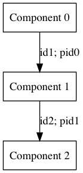
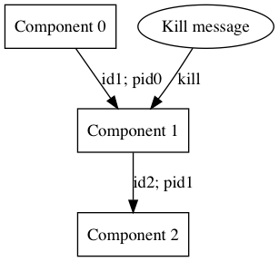
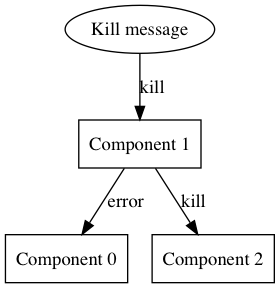

## Технический уровень

Сообщения на техническом уровне предназначены для управления и оценки состояния как системы в целом, так и отдельных её компонентов.
Сообщения на данном уровне формируются согласно описанному протоколу.
Текущий документ описывает конкретные виды сообщений, которые каждый компонент в системе должен уметь обрабатывать.


### Мониторинг (spec = monitoring)

Данный вид сообщений вводится для отслеживания состояния системы.
Сообщения для мониторинга реализуют подход "вопрос-ответ".

Запрос на мониторинг имеет следующее поле внутри поля `config`:

* `sync_time :: Timestamp` - время для синхронизации, которое требуется компоненту-мониторингу для синхронизации возвращаемых сообщений.

Полный вид сообщения:

```
tag: "config:monitoring:<id>:<pid>:<creator>"

content:
{
  id         :: Hash,
  pid        :: Hash | null,
  creator    :: String,
  created_at :: Timestamp,
  expires_at :: Timestamp,
  spec       :: String,
  config     :
  { 
    sync_time :: Timestamp 
  }
}
```

Ответное сообщение в случае успешного ответа содержит следующие поля внутри `result`:

* `sync_time :: Timestamp` - время для синхронизации, совпадает с полученным времени в запросе;
* `name :: String` - имя компонента, которое задаётся разработчиком и указывается в документации (TODO: написать про имя компонента);
* `host :: String` - хост машины, на котором развёрнут компонент;
* `is_running :: Bool` - принимает значение `true`, если компонент выполняет какую-либо работу, иначе `false`;
* `message :: String` - дополнительный комментарий (небольшого размера), который разработчик компонента может отсылать по своему усмотрению.

Полный вид сообщения:

```
tag: "result:monitoring:<id>:<pid>:<creator>"

content:
{
  id         :: Hash,
  pid        :: Hash | null,
  creator    :: String,
  created_at :: Timestamp,
  expires_at :: Timestamp,
  spec       :: String,
  result     : 
  { 
    sync_time  :: Timestamp,
    name       :: String,
    host       :: String,
    is_running :: Bool,
    message    :: String
  }
}
```

### Завершение работы компонента (spec = kill)

Данный вид сообщений вводится для прерывания выполнения задачи.

## Реализация протокола

### Завершение работы компонента

Рассмотрим общий случай: пусть у компоненты "выстроены" в цепочку запусков, компонент 0 запустил компонент 1, компонент 1 запустил компонент 2 и т.д.



Пусть сообщение с полем `spec = kill` пришло компоненту в середине этой цепочки. Он должен действовать  по следующему алгоритму:




Алгоритм экстренного завершения работы компонента:
1. Компонент посылает сообщение `spec = kill` всем компонентам, которых он запустил;
2. Компонент завершает работу.
3. Компонент посылает сообщение с ошибкой `message_type = error` запустившему его компоненту по pid.


